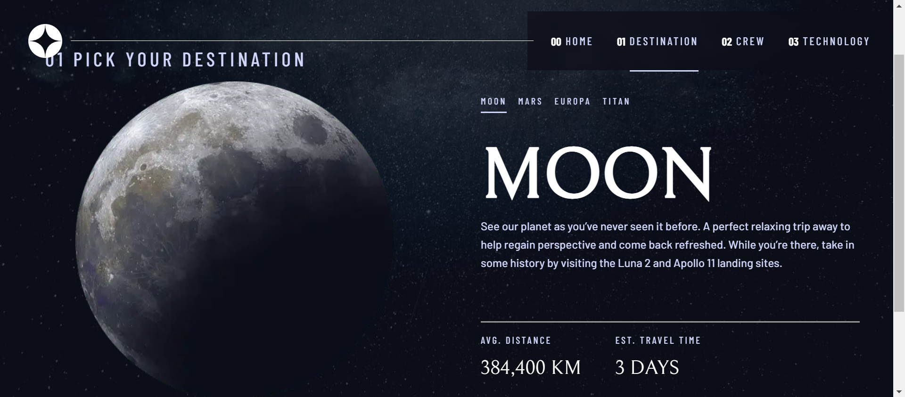

# Frontend Mentor - Space tourism website solution

This is a solution to the [Space tourism website challenge on Frontend Mentor](https://www.frontendmentor.io/challenges/space-tourism-multipage-website-gRWj1URZ3). Frontend Mentor challenges help you improve your coding skills by building realistic projects.

## Table of contents

- [Overview](#overview)
  - [The challenge](#the-challenge)
  - [Screenshot](#screenshot)
  - [Links](#links)
- [My process](#my-process)
  - [Built with](#built-with)
  - [What I learned](#what-i-learned)
  - [Continued development](#continued-development)
  - [Useful resources](#useful-resources)
- [Author](#author)

## Overview

### The challenge

Users should be able to:

- View the optimal layout for each of the website's pages depending on their device's screen size
- See hover states for all interactive elements on the page
- View each page and be able to toggle between the tabs to see new information

### Screenshot



### Links

- Solution URL: [Solution URL](https://github.com/csoumya14/space-tourism.git)
- Live Site URL: [Live site URL](https://space-tourism-893q-rfbhwfki6-csoumya14.vercel.app/)

## My process

### Built with

- Semantic HTML5 markup
- CSS custom properties
- Flexbox
- Mobile-first workflow
- [React](https://reactjs.org/) - JS library
- [Typescript](https://www.typescriptlang.org/) - Javascript with syntax for types
- [Next.js](https://nextjs.org/) - React framework
- [Styled Components](https://styled-components.com/) - For styles

### What I learned

- I learned how to create pages, shared layouts inside the App Router in Nextjs 13 .
- How to use multiple fonts styling in nextjs 13 with css variables.
- How to make a reusable and accessible tab component.

#### Some code that I am proud of

```css
&[aria-current="page"] {
    border-bottom: 2px solid;
    border-color: ${(props) => props.theme.palette.primary.lightBlue};
  }
```

```js
<Image
  src={imageSrc}
  fill
  id={`tab-${tabsPrefix}-tabImage-${tab}`}
  alt={altText}
  style={{
    objectFit: "contain",
  }}
/>
```

### Continued development

I would like to add animation to the project in the future.

### Useful resources

- [Use different font styles in nextjs13]https://medium.com/@a.pirus/simplifying-multiple-fonts-styling-in-next-js-13-with-css-variables-cb57e9707693)
- [Create a hamburger menu with styled components](https://css-tricks.com/hamburger-menu-with-a-side-of-react-hooks-and-styled-components/)
- [Build an accessible tab component in react](https://jser.dev/react/2022/07/25/build-an-accessible-tab-component-in-react/#a-better-approach---with-accessibility-built-in)

**Note: Delete this note and replace the list above with resources that helped you during the challenge. These could come in handy for anyone viewing your solution or for yourself when you look back on this project in the future.**

## Author

- Website - [Soumya Chalakkal](https://soumya-portfolio.vercel.app/)
- Frontend Mentor - [@csoumya14](https://www.frontendmentor.io/profile/csoumya14)
